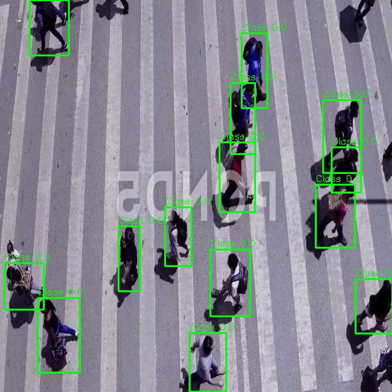
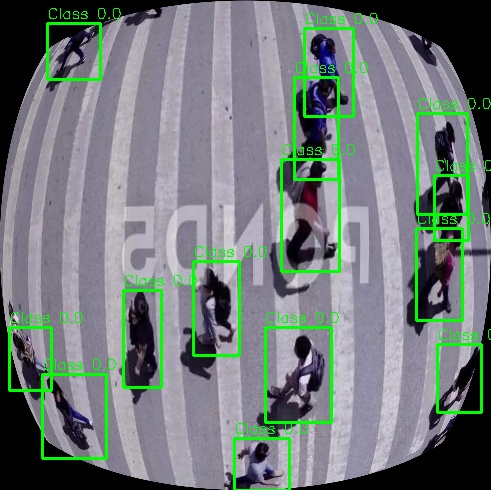

# Fisheye Dataset Transformer

    

## 📌 Introduction
This repository provides a pipeline to transform a YOLO format dataset, containing images and bounding boxes, into a fisheye-transformed version. It takes into account the camera calibration parameters (intrinsic matrix `K` and distortion coefficients `D`) to generate a fisheye effect and update the bounding boxes accordingly. The final dataset is in the same YOLO format but adapted to the fisheye transformation.

## Original Bounding Box
<p align="center">

</p>

### Fisheye Bounding Box
<p align="center">
    
</p>

## 📚 Dataset Format
```
Dataset/
├── train/
│   ├── images/
│   └── labels/
├── valid/
│   ├── images/
│   └── labels/
├── test/ (optional)
│   ├── images/
│   └── labels/
└── data.yaml
```

## 🚀 How It Works

### 🎥 Fisheye Image Transformation
1. **Square Resize**: The image is resized to a square to maintain isotropic distortion using the `resize_to_square()` function.

2. **LUT (Lookup Table) Computation**:
   - Uses camera parameters to compute a distortion map via the `create_LUT_table()` function.
   - The LUT is calculated once using a sample image and reused for all images.

3. **Fisheye Transformation**:
   - Applies the distortion map to each image using the `apply_fisheye()` function.
   - Crops black borders if necessary to maintain relevant content using `crop_black_borders()`.

4. **Bounding Box Adjustment**:
   - Converts bounding boxes from YOLO format to absolute coordinates using `yolo_to_absolute()`.
   - Applies the same fisheye transformation to bounding box masks using `generate_bbox_mask()` and `apply_fisheye()`.
   - Recalculates the bounding box position and size after transformation using `find_fisheye_yolo_bbox()`.

### 🌀 Parallel Processing
- Utilizes `ProcessPoolExecutor` for multi-core processing, where each image is processed in parallel to speed up the transformation.
- Computes the LUT once and shares it among worker processes.

### 🗃️ Dataset Update
- Updates the `data.yaml` file to reflect the new transformed dataset paths using `update_yaml()`.

## 🔧 How to Use

```python
from process_yolo_dataset import process_yolo_subset, update_yaml, get_LUT
import os
import numpy as np

DATASET_DIR = "./person_dataset"
OUTPUT_DIR = "./fisheye2_person_dataset"
SUBSETS = ['train', 'test', 'valid']

K = np.array([[284.509100, 0, 2.0],
              [0, 282.941856, 2.0],
              [0, 0, 1.000000]], dtype=np.float32)

D = np.array([-0.614216, 0.060412, -0.054711, 0.011151], dtype=np.float32)

map_x, map_y = get_LUT(DATASET_DIR, K, D)

for subset in SUBSETS:
    images_dir = os.path.join(DATASET_DIR, subset, 'images')
    labels_dir = os.path.join(DATASET_DIR, subset, 'labels')
    output_images_dir = os.path.join(OUTPUT_DIR, subset, 'images')
    output_labels_dir = os.path.join(OUTPUT_DIR, subset, 'labels')
    process_yolo_subset(images_dir, labels_dir, output_images_dir, output_labels_dir, map_x, map_y)

input_yaml = os.path.join(DATASET_DIR, 'data.yaml')
output_yaml = os.path.join(OUTPUT_DIR, 'data.yaml')
update_yaml(input_yaml, output_yaml, OUTPUT_DIR)
```

## 👀 Visualization Utility
```python
from generate_new_bboxes import draw_yolo_bboxes, load_yolo_bboxes
import cv2

image = cv2.imread("fisheye2_person_dataset/train/images/image1.jpg")
labels = load_yolo_bboxes("fisheye2_person_dataset/train/labels/image1.txt")
image_with_boxes = draw_yolo_bboxes(image, labels)
cv2.imwrite("output/image1_preview.jpg", image_with_boxes)
```

## ⚠️ Limitations
- Bounding boxes remain rectangular.
- The transformation may discard bounding boxes that are too small or outside the fisheye field of view.

